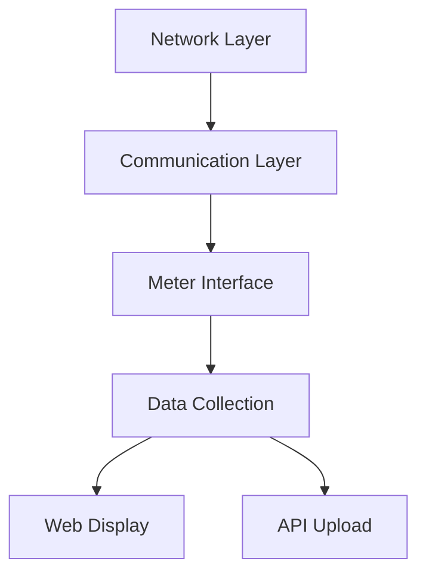

# System Patterns: AmpX Energy Gateway

## Architecture Overview
The AmpX Energy Gateway follows a layered architecture pattern as observed in the existing implementation:

## Key Components

### Communication Layer
- Handles either RS485 or TCP/IP communication (via compile-time directives)
- Includes functions for reading meter registers
- Features modular design with shared utility functions
- Separates communication logic from business logic

### Meter Interface
- Implements meter register definitions via JsonDocument
- Processes different data types (float, int32, int64)
- Manages meter identification via serial numbers
- Structures data for further processing

### Data Collection
- Polls meters at regular intervals (3 seconds for web updates)
- Uses dynamic JsonDocument for data storage
- Detects meters automatically
- Maintains current meter values

### Web Display
- Serves local web interface via WebServer
- Uses WebSockets for real-time data updates
- Presents tabular meter data
- Includes basic settings management

### API Upload
- Formats data as JSON for API submission
- Schedules uploads every 5 minutes
- Posts to the remote AmpX portal
- Includes authentication parameters

## Design Patterns

### Conditional Compilation
Used for hardware variant selection (RS485 vs TCP/IP) to manage code size and isolate differences.

### Observer Pattern
WebSocket implementation acts as an observer, notifying clients about data changes.

### Factory Method
Meter data processing acts as a factory method, creating appropriate data representations based on register types.

## Data Flow
1. Gateway initializes hardware (RS485 or Ethernet based on compile flag)
2. Meters are detected during initialization 
3. Regular polling occurs in the main loop
4. Data is processed and stored in JsonDocument
5. WebSocket sends updates to connected clients
6. Periodic API uploads occur on schedule

## Observed Optimization Opportunities

### Memory Management
- Current String usage could be optimized with char arrays
- JSON document sizing now improved with DynamicJsonDocument

### Error Handling Strategy
- Communication failures are logged but recovery is limited
- Daily ESP restart suggests potential memory leak concerns
- Opportunity to improve error detection and recovery

### Component Coupling
- High coupling between meter reading and data processing 
- Global variables create implicit dependencies
- Opportunity for better encapsulation

## Current Architecture Strengths
- Clear separation between communication protocols
- Effective use of conditional compilation
- Good modularity in file organization
- Flexible data processing for different register types

This document captures observations from the actual codebase, identifying both the implemented patterns and opportunities for architectural improvements. 