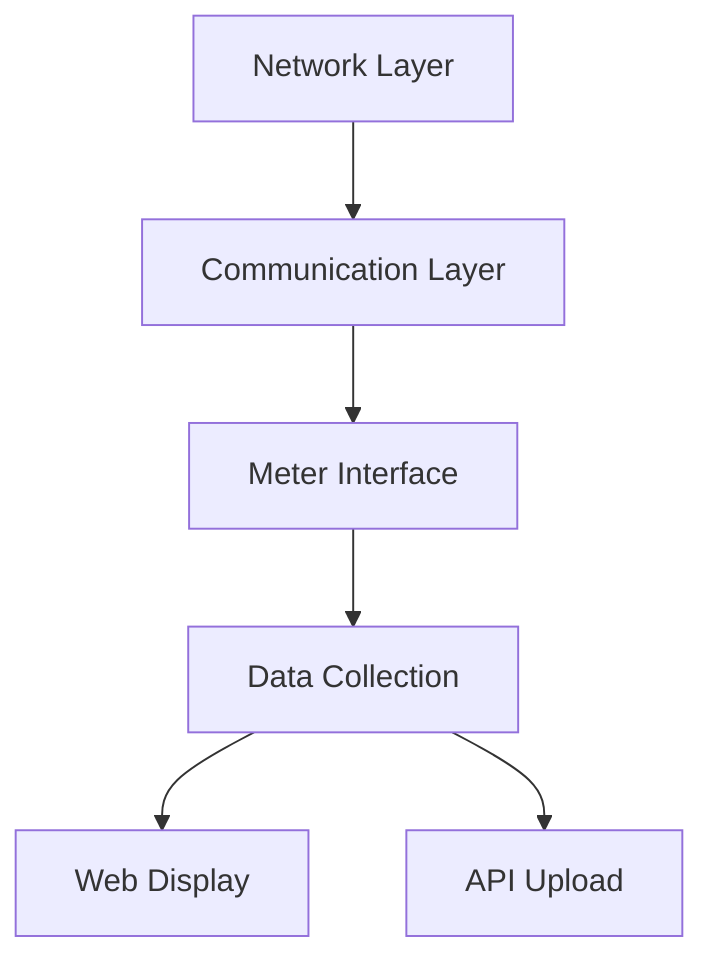

# System Patterns: AmpX Energy Gateway

## Architecture Overview
The AmpX Energy Gateway now features a unified architecture for both RS485 and TCP/IP Modbus communication, with shared utility functions and modular initialization routines.

## Key Components

### Communication Layer
- Handles both RS485 and TCP/IP communication via compile-time selection
- Shared functions for register conversion (float, int32, int64)
- Unified meter handler (`handlePowerMeter`) for all meter types
- Modular initialization for NVS, WiFi, NTP, and Ethernet

### Meter Interface
- Meter register definitions and data types managed via JSON
- Unified processing of all meter data
- Serial number and special register handling included

### Data Collection
- Auto-detects number of connected meters (currently up to 4, architecture supports more)
- Polls meters at regular intervals
- Stores data in a global DynamicJsonDocument

### Web Display
- Local web interface with real-time updates via WebSockets
- Status LEDs for power, meter, WiFi, and internet/API status

### API Upload
- Two API upload methods: WordPress endpoint and Docker API
- Custom JSON formatting for each API
- Uploads data at scheduled intervals

## Design Patterns

### Shared Utility Functions
- Centralized register conversion and data processing for maintainability

### Unified Handler
- Single function for all meter types simplifies code and reduces duplication

### Modular Initialization
- Separate functions for NVS, WiFi, NTP, and Ethernet setup

### Status Indication
- LEDs provide real-time feedback for system state and error conditions

## Data Flow
1. System initializes hardware and network
2. Meters are auto-detected
3. Data is polled and processed into JSON
4. WebSocket and API uploads occur on schedule
5. Status LEDs indicate system health

## Observed Optimization Opportunities
- Move credentials and API endpoints to persistent storage
- Optimize string handling to reduce memory fragmentation
- Further modularize error handling and recovery

## Current Architecture Strengths
- Unified, maintainable codebase for all meter types
- Robust initialization and error/status indication
- Flexible API integration

This document reflects the latest system patterns and architectural improvements from the most recent code review. 